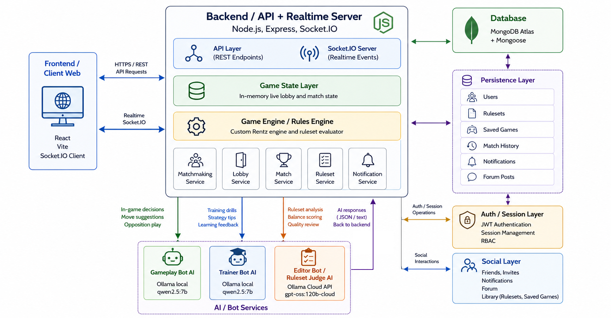

# Rentz Arena

## Descriere

Rentz Arena este o platformă multiplayer pentru jocul de cărți Rentz, cu lobby-uri și gameplay în timp real, ruleset-uri personalizabile, editor dedicat pentru reguli și integrare cu boți AI pentru joc, training și evaluarea ruleset-urilor. Proiectul include și funcționalități sociale, salvare și reluare de partide, istoric de meciuri și sistem ELO/rank.

## Membrii echipei

- Nedelcu Alexandru-Constantin (grupa 241)
- Săndulescu Ioan (grupa 241)
- Ghiță Radu-Ioachim (grupa 252)
- Pascariu Alexandru Carlo (grupa 252)

## Funcționalități principale

- autentificare și profil utilizator
- camere multiplayer, lobby-uri și joc în timp real prin Socket.IO
- reguli și ruleset-uri personalizabile pentru partide și training
- editor de ruleset-uri cu validare și preview
- AI Gameplay Bot pentru locuri controlate automat
- AI Trainer Bot pentru meciuri de antrenament și feedback
- AI Ruleset Judge / Editor Bot pentru evaluarea ruleset-urilor
- funcționalități sociale: forum, prieteni, invitații și notificări
- salvare joc și reluare ulterioară din sesiuni persistate
- istoric meciuri, ELO și rank pentru conturile autentificate
- teste automate pentru backend și frontend, plus evaluări dedicate pentru boți

## Tehnologii utilizate

- Frontend: React, Vite
- Backend: Node.js, Express, Socket.IO
- Bază de date: MongoDB prin Mongoose, cu suport pentru MongoDB Atlas
- AI: Ollama local, endpoint-uri cloud compatibile Ollama, LangChain, Promptfoo
- Testing: Vitest, React Testing Library, Supertest, mongodb-memory-server
- CI/CD: GitHub Actions

## Structura proiectului

- `frontend/` aplicația web React + Vite
- `backend/` API-ul Express, logica jocului, socket-uri și integrarea cu baza de date
- `evals/` suite Promptfoo pentru Gameplay Bot, Trainer Bot și Editor Bot
- `docs/` documentația proiectului, diagrame, testare și CI/CD
- `.github/workflows/` workflow-uri pentru CI, evaluări manuale și deploy

## Diagrame

- [Index diagrame](docs/diagrams/README.md)
- [Diagrame UML și Mermaid](docs/uml.md)
- [Imagine arhitectură software](docs/assets/rentz-arena-software-architecture.png)



## Link-uri utile

- [Trello](https://trello.com/b/jerqOuXW/rentzduearena)
- [Raport folosire tool-uri AI](docs/Raport_Tooluri_AI.pdf)
- [User Stories](docs/user-stories.md)
- [Backlog](BACKLOG.md)
- [Documentație testare](docs/testing.md)
- [Documentație CI/CD](docs/ci-cd.md)

## Rulare locală

Proiectul necesită `Node.js >= 20`. Cea mai simplă variantă de pornire din rădăcina repository-ului este:

```bash
npm run install:all
cp backend/.env.example backend/.env
npm run db:start
npm run dev
```

Observații:

- `npm run dev` pornește backend-ul și frontend-ul în paralel.
- fișierul `backend/.env` este necesar pentru configurarea backend-ului; nu includeți secrete în repository.
- implicit, backend-ul poate folosi MongoDB local prin Docker Compose; dacă preferați MongoDB Atlas, actualizați conexiunea din `backend/.env`.
- pentru evaluări live ale boților sau pentru anumite fluxuri AI, este necesară configurarea Ollama local sau a unui endpoint cloud compatibil.

## Testare

Comenzi utile din rădăcina proiectului:

```bash
npm test
npm run test:backend
npm run test:frontend
npm run test:unit
npm run test:integration
npm run test:coverage
npm run eval:bots:mock
npm run eval:gameplay-bot:mock
npm run eval:trainer-bot:mock
npm run eval:editor-bot:mock
```

Pentru evaluările live sau cloud există și scripturi dedicate, de exemplu `eval:trainer-bot:fast`, `eval:gameplay-bot:real` și `eval:editor-bot:cloud`, care au nevoie de configurări suplimentare. Detalii suplimentare se găsesc în [docs/testing.md](docs/testing.md) și [evals/promptfoo/README.md](evals/promptfoo/README.md).

## CI/CD

CI rulează automat pe `push` și `pull_request` pentru ramurile `main` și `develop`, instalând dependențele, rulând testele existente, evaluările mock pentru boți și build-ul de frontend. Repository-ul include și workflow-uri manuale pentru evaluări suplimentare și deploy prin SSH către serverul echipei.

În GitHub Actions nu se rulează evaluări locale reale dependente de Ollama decât dacă există infrastructură dedicată, de tip self-hosted runner. Pentru configurare și detalii complete, consultați [docs/ci-cd.md](docs/ci-cd.md).
