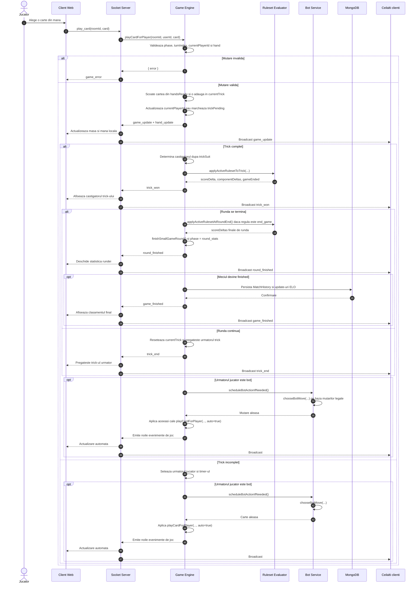
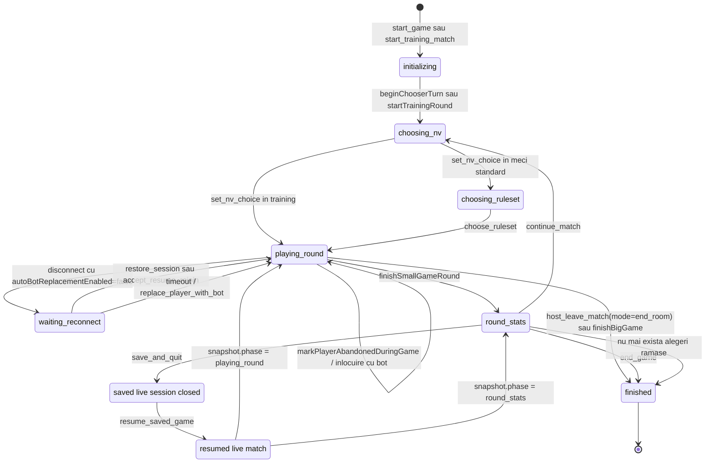
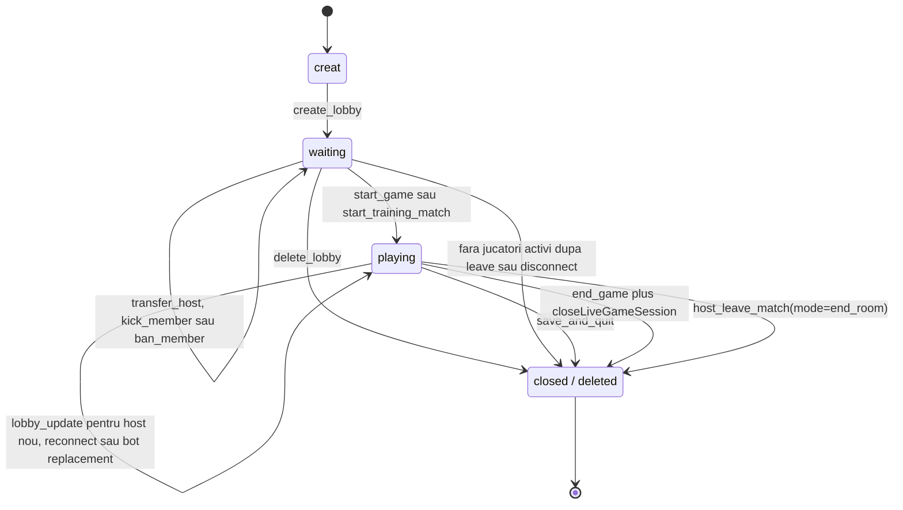
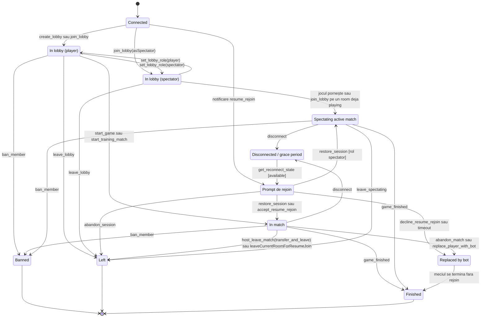
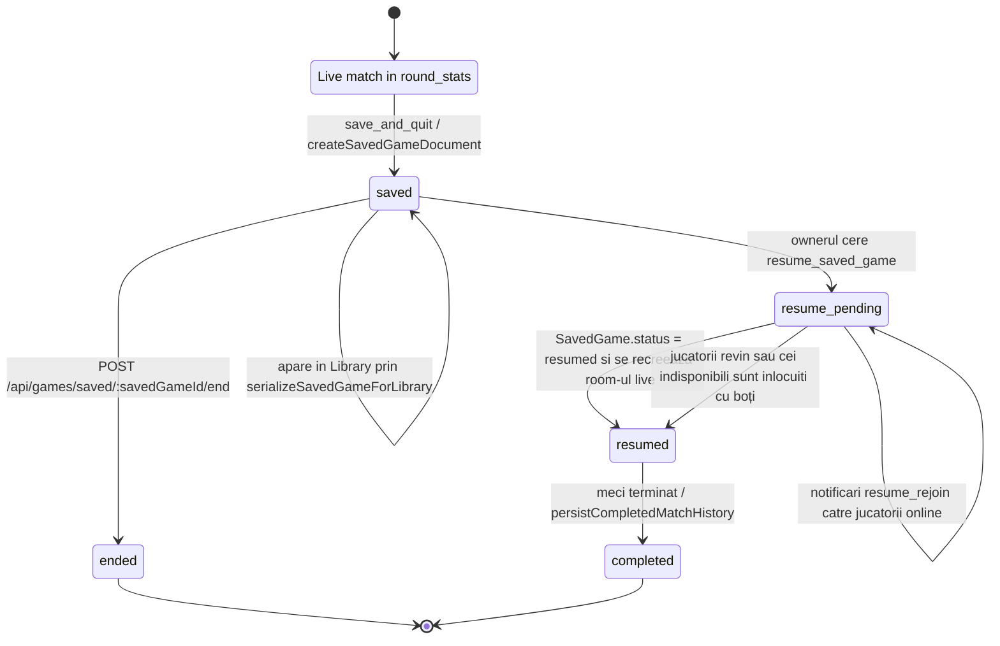

# UML Diagrams

Acest document conține diagrame Mermaid generate pe baza implementării curente Rentz Arena, în special din fluxurile din `backend/socketManager.js`, serviciile de persistență și boți, modelele MongoDB și integrarea socket din `frontend/src/App.jsx`.

## Software Architecture Overview

Imaginea de mai jos oferă o vedere de ansamblu a arhitecturii proiectului, inclusiv clientul web, serviciile backend, persistența și serviciile AI configurate în proiect.

## Sequence Diagram — Card Play Flow

Diagrama urmărește fluxul real pentru `play_card`: clientul emite evenimentul socket, `socketManager` delegă în `playCardForPlayer`, engine-ul validează tura și cartea, aplică regulile active la final de trick, transmite update-urile către toți clienții și poate porni automat mutarea unui bot.

## State Diagram — Game / Match

Diagrama surprinde ciclul de viață al meciului live așa cum este modelat în `activeGames`: alegerea `NV`, selecția de ruleset, jocul pe trick-uri, statistica de rundă, reconectarea, salvarea și reluarea din `SavedGame`, plus închiderea meciului.

## State Diagram — Room / Lobby

Diagrama descrie ciclul camerei gestionate în `lobbies`: creare, configurare și pregătire înainte de start, trecerea în joc activ și închiderea camerei după ștergere, salvare sau terminarea sesiunii live.

## State Diagram — Player Session

Diagrama urmărește sesiunea unui utilizator prin lobby, joc activ sau spectare, inclusiv refresh/reopen, `restore_session`, promptul de rejoin, abandonul, banarea și înlocuirea cu bot după timeout sau refuz.

## State Diagram — Saved Game

Diagrama rezumă ciclul unui `SavedGame` din MongoDB: creare prin `save_and_quit`, apariție în Library, reluare cu `resume_saved_game`, notificări de `resume_rejoin`, înlocuirea jucătorilor indisponibili cu boți și finalizarea sau închiderea definitivă.

